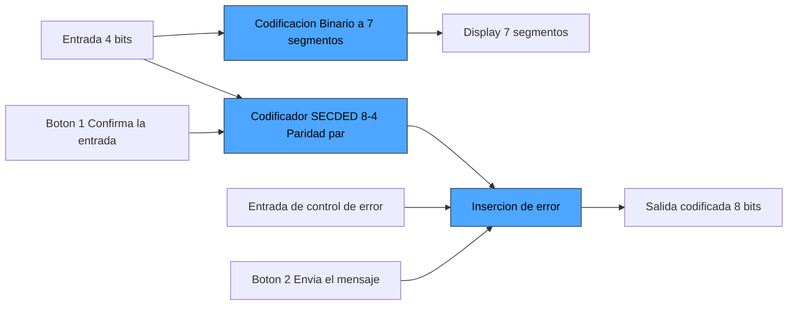
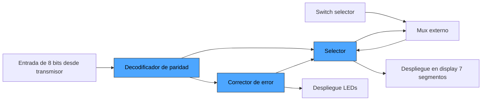

# Proyecto_1_Alberto_Arce


# Proyecto Corto I: Diseño Digital Combinacional en Dispositivos Programables

**EL-3307 Diseño Lógico — I Semestre 2026**  
**Escuela de Ingeniería Electrónica, Instituto Tecnológico de Costa Rica**

---

## Tabla de Contenidos

1. [Descripción General del Sistema](#1-descripción-general-del-sistema)
2. [Módulos del Transmisor](#2-módulos-del-transmisor)
3. [Módulos del Receptor](#3-módulos-del-receptor)
4. [Simplificación Booleana: Corrector de Error](#4-simplificación-booleana-corrector-de-error)
5. [Simplificación Booleana: Display de 7 Segmentos](#5-simplificación-booleana-display-de-7-segmentos)
6. [Simulación Funcional del Sistema Completo](#6-simulación-funcional-del-sistema-completo)
7. [Análisis de Recursos en la FPGA](#7-análisis-de-recursos-en-la-fpga)
8. [Problemas Encontrados y Soluciones Aplicadas](#8-problemas-encontrados-y-soluciones-aplicadas)

---

## 1. Descripción General del Sistema

En este proyecto se desarrolla un sistema de comunicación digital basado en el código SECDED[8:4], diseñado para trabajar con FPGAs Tang Nano 9k.El sistema se divide en dos bloques principales: transmisor y receptor,cada uno implementado en una FPGA independiente. Ambas comparten la terminal GND y se comunican mediante 8 líneas de datos

El objetivo es transmitir una palabra de 4 bits de datos entre las dos FPGAs, introducir opcionalmente un error en un bit durante la transmisión, y que el receptor sea capaz de detectar, localizar y corregir dicho error y adicionalmente que sea capaz de detectar si se introdujo dos errores, con la limitación de no poder corregirlos ni ubicarlos.


### Diagrama de Bloques General del Sistema

```

                                      Input[3:0]
                                        │ 
                        ┌───────────────────────────────┐
 Boton 1 ──────────────►│                               │
 Boton 2 ──────────────►│     FPGA TRANSMISOR           |
                        │                               │
(Switch error input)───►│                               |
             Error [2:0]│                               │
                        │                               │
                        │                               │   seg[6:0]     ───────────────────
                        │                               ├─────────────► |Display 7 segmentos|
                        └───────────────────────────────┘                ──────────────────
                           |                     |
 Mensaje codificado [7:0]  │                     │ GND compartida
                           ↓                     ↓
                        ┌───────────────────────────────┐ 
                        │                               │────────────►LED 
                        │      FPGA RECEPTOR            |
                        │                               │
                        │                               │
                        │                               │   seg[6:0]     ───────────────────
                        │                               ├─────────────► |Display 7 segmentos|
                        └───────────────────────────────┘                ──────────────────
    Palabra decodificada[3:0] │  Sindrome[3:0] |     ↑  
                              ↓                ↓     | Canal selecionado [3:0]        
                              ────────────────────────      
  (Switch Selector)──────►   |     MUX externo        |
                              ────────────────────────

```

---

## 2. Módulos del Transmisor
## Diagrama de bloques del transmisor 

### 2.1. Módulo de Codificación SECDED (8,4) con Paridad Par

**Entradas:** `datos[3:0]`  
**Salidas:** `SECDED[7:0]` hacia el modulo de incersion de error

Este módulo recibe 4 bits de datos y genera una palabra codificada de 8 bits según el esquema SECDED (8,4) con paridad par. La distribución de bits sigue la siguiente conveción:

| Posición |   0  |  1   |  2   |  3   |  4   |  5   |  6   |  7   |
|----------|------|------|------|------|------|------|------|------|
| Bit      | P0   | P1   | P2   | d1   | P4   | d2   | d3   | d4   |


Los bits de paridad se calculan como:

```
P0 = P0 ⊕ P1 ⊕ P2 ⊕ d1 ⊕ P4 ⊕ d2 ⊕ d3 ⊕ d4 (cubre todas las posiciones)
P1 = d1 ⊕ d2 ⊕ d4   (cubre posiciones 1, 3, 5, 7)
P2 = d1 ⊕ d3 ⊕ d4   (cubre posiciones 2, 3, 6, 7)
P3 = d2 ⊕ d3 ⊕ d4   (cubre posiciones 4, 5, 6, 7)
```


### 2.2. Módulo de Codificación Binario a 7 Segmentos

**Entradas:** `datos[3:0]`  
**Salidas:** `seg[6:0]` hacia el display

Convierte la palabra de 4 bits ingresada por el usuario a su representación hexadecimal y la envia al display de 7 segmentos. Permite verificar visualmente el dato antes de su transmisión.

### 2.3. Módulo Generador de Error

**Entradas:** `hamming[6:0]`, `error_pos[2:0]`  
**Salidas:** `datos_tx[6:0]` hacia la FPGA receptora 

Recibe la palabra SECDED codificada y un valor de 3 bits que indica la posición del bit a invertir (1–7) y espera la confirmacion del boton 2 para enviar el mensaje codificado 


## 3. Módulos del Receptor
## Diagrama de bloques del receptor

### 3.1. Módulo Decodificador de Paridad

**Entradas:** `i[7:0]` (palabra de 8 bits recibida)  
**Salidas:** `sindrome[2:0]` (posición del bit con error) , `Error en bit de paridad global` (P0)
Este módulo recibe los 8 bits transmitidos y calcula el **síndrome de Hamming** mediante tres comprobaciones de paridad par. Cada síndrome corresponde a la XOR de los bits en las posiciones que cubre cada bit de paridad:

Se asume que la palabra recibida es de forma: 

| Posición |   0  |  1   |  2   |  3   |  4   |  5   |  6   |  7   |
|----------|------|------|------|------|------|------|------|------|
| Bit      | P0   | P1   | P2   | d1   | P4   | d2   | d3   | d4   |
```

s0 = P1 ⊕ d1 ⊕ d2 ⊕ d4   // paridad P1: posiciones 1,3,5,7
s1 = P2 ⊕ d1 ⊕ d3 ⊕ d4   // paridad P2: posiciones 2,3,6,7
s2 = P4 ⊕ d2 ⊕ d3 ⊕ d4   // paridad P4: posiciones 4,5,6,7
sindrome = {s2, s1, s0}
```
El  valor binario del sindrome indica la posicion del bit corrupto por ejemplo 101 dice que el bit dañado esta en la posicion 5 

Adicionalmente calula el bit de paridad global S0 
```

S0 = P0 ⊕ P1 ⊕ P2 ⊕d1 ⊕ P4 ⊕ d2 ⊕d3 ⊕ d4   // paridad global: todas las posiciones

```


### 3.2. Módulo Corrector de Error

**Entradas:** `i[7:0]`, `sindrome[2:0]`, `S0`
**Salidas:** `palabra_corregida[3:0]`

Recibe los 8 bits de la palabra recibida, el síndrome calculado por el decodificador y el bit de paridad global. Corrige el bit indicado por el síndrome invirtiendo únicamente ese bit, y luego extrae los 4 bits de datos (posiciones 3, 5, 6, 7 → d1, d2, d3, d4):

Si el síndrome es `000` (no hay error), ningún bit se invierte y los datos pasan sin modificación.
Si se detecta que el bit de paridad global (S0) es igual cero y que al menos un bit del sindrome da uno, se detecta que hubo dos errores y se enciende una LED externa a la FPGA para indicarlo  

### 3.3. Módulo de Despliegue en LEDs

**Entradas:** `palabra_corregida[3:0]`  
**Salidas:** `leds[3:0]`

Módulo directo: cada bit de la palabra corregida controla un LED de la FPGA. El LED enciende cuando el bit correspondiente es `1`.


### 3.4. Módulo de Despliegue en Display de 7 Segmentos (Receptor)

**Entradas:** `y[3:0]` (salida del mux)  
**Salidas:** `seg[6:0]` hacia el display

Convierte la palabra de 4 bits seleccionada (dato corregido o posición del error) a formato hexadecimal en el display de 7 segmentos externo (protoboard). La codificación es catodo comun, activo en alto.


### 3.5. Módulo Selector 

**Entradas:** `palabra_corregida[3:0]`, `sindrome[2:0]` ,
**Salidas:** `y[3:0]` → retroalimentado a FPGA para el display
Le agrega un 0 al pricipio del del sindrome de modo que queda como {0,s4,s2,s1}
Los datos salen a un circuito que es un multiplexor 2:1 de 4 bits implementado físicamente en la protoboard con compuertas lógicas. 
Los datos con la palabra corregida y la posicion del error salen al mux y el regresa el canal que el usurio elija y lo envia al modulo del display 7 segmentos 

```
Funcionamiento del Mux 2:1 de 4 bits

|`Switch_mode`| Salida                |
|-------------|-----------------------|
| 0 (OFF)     | `palabra corregida`   |
| 1 (ON)      | `posicion del error  `|

El cuarto bit de `posicion de error` se mapea a `0` ya que el síndrome es de solo 3 bits y el cuarto no es determinante.
```

## 4. Simplificación Booleana: Corrector de Error

### Ejemplo: Corrección del bit de datos `d1` (posición 3)

El bit de datos `d1` se encuentra en la posición 3 del código Hamming, es decir, `i[2]`. Se debe invertir únicamente cuando el síndrome es `3'b011` (valor decimal 3).

**Entradas:** `s2`, `s1`, `s0` (bits del síndrome)  
**Salida:** `flip_d1` (vale 1 cuando hay que invertir la posición 3)

La función booleana es:

```
flip_d1 = s2' · s1 · s0
```

**Mapa de Karnaugh (3 variables):**

```
   \    s1 s0
s2   | 00 | 01 | 11 | 10 |
-----|----|----|----|----|
  0  |  0 |  0 |  1 |  0 |
  1  |  0 |  0 |  0 |  0 |
```

El único mintérmino es m3 = s2'·s1·s0. No hay posibilidades de agrupamiento, por lo que la expresión mínima en SOP es:

```
flip_d1 = s2' · s1 · s0
```


**Expresión final corregida para `d1`:**

```
datos_corr[0] = i[2] XOR (s2' · s1 · s0)
```

---

## 5. Simplificación Booleana: Display de 7 Segmentos

El display de 7 segmentos despliega valores hexadecimales (0–F). Las entradas son `{d1, d2, d3, d4}` con d1 como MSB. La lógica es **cátodo común** (activo en 1).

> Ejemplo: `{d1,d2,d3,d4} = 0101` → valor 5.

### Segmento `a` (segmento superior horizontal)

| Hex | d1 d2 d3 d4 | seg_a |   | Hex | d1 d2 d3 d4 | seg_a |
|-----|-------------|:-----:|---|-----|-------------|:-----:|
| 0   | 0 0 0 0     | 1     |   | 8   | 1 0 0 0     | 1     |
| 1   | 0 0 0 1     | 0     |   | 9   | 1 0 0 1     | 1     |
| 2   | 0 0 1 0     | 1     |   | A   | 1 0 1 0     | 1     |
| 3   | 0 0 1 1     | 1     |   | b   | 1 0 1 1     | 0     |
| 4   | 0 1 0 0     | 0     |   | C   | 1 1 0 0     | 1     |
| 5   | 0 1 0 1     | 1     |   | d   | 1 1 0 1     | 0     |
| 6   | 0 1 1 0     | 1     |   | E   | 1 1 1 0     | 1     |
| 7   | 0 1 1 1     | 1     |   | F   | 1 1 1 1     | 1     |

### Mapa de Karnaugh

```
  \  d3 d4
d1 d2  | 00 | 01 | 11 | 10 |
-------|----|----|----|----|
  00   |  1 |  0 |  1 |  1 |
  01   |  0 |  1 |  1 |  1 |
  11   |  1 |  0 |  1 |  1 |
  10   |  1 |  1 |  0 |  1 |
```

Agrupaciones (todos implicantes primos esenciales):

| Grupo | Mintérminos | Término     |
|-------|-------------|-------------|
| G1    | {0,2,8,10}  | d2'·d4'     |
| G2    | {2,3,6,7}   | d1'·d3      |
| G3    | {6,7,14,15} | d2·d3       |
| G4    | {5,7}       | d1'·d2·d4   |
| G5    | {8,9}       | d1·d2'·d3'  |
| G6    | {12,14}     | d1·d2·d4'   |

> G1 y G6 utilizan el wrap del mapa (los bordes opuestos son adyacentes).

### Expresión mínima

```
seg_a = d2'·d4' + d1'·d3 + d2·d3 + d1'·d2·d4 + d1·d2'·d3' + d1·d2·d4'
```
## 6. Simulación Funcional del Sistema Completo

### 6.1. Descripción del testbench

Se implementaron cinco testbenches  para validar cada módulo de forma
independiente y el sistema completo :

| Archivo  | Tipo de prueba |
|---|--|
| `tb_decodificador_paridad`  | Sin error, error simple en cada bit, doble error |
| `tb_correccion_error`  | Corrección de cada bit de dato y de paridad |
| `tb_despliegue_leds`  | Los 16 valores posibles con verificación PASS/FAIL |
| `tb_despliegue_7seg`  | Los 16 dígitos hex con PASS/FAIL automático |
| `tb_selector`  | Selección de palabra vs síndrome |
| `tb_receptor_top`  | Sistema completo: sin error, errores simples, doble error |

### 6.2. Análisis de la simulación de todo el sistema

El testbench `tb_receptor_top` revisa el sistema completo con 8 vectores de prueba.
El dato de referencia utilizado es `d1=1, d2=0, d3=1, d4=1` (valor hexadecimal seria **B**),
cuyas paridades correctas serian `P1=0, P2=1, P4=0, P0=0`.

---

#### Caso 1 — Sin error, MUX muestra palabra corregida

El síndrome resultante es `000`, confirmando que la palabra llegó sin alteraciones.
Los LEDs reflejan el dato original `1011` y el display muestra correctamente el valor
hexadecimal **b**. El bit de paridad global P0 no detecta discrepancia, por lo que
`error_led` permanece en cero.


---

#### Casos 2–5 — Error simple en cada bit de dato

| Caso | Bit con error | Síndrome obtenido | LEDs (corregido) | Display |
|---|---|---|---|---|
| 2 | d1 (posición 3) | `011` → 3 | `1011` ✓ | `1111001` = **3** |
| 3 | d2 (posición 5) | `101` → 5 | `1011` ✓ | `1011011` = **5** |
| 4 | d3 (posición 6) | `110` → 6 | `1011` ✓ | `1011111` = **6** |
| 5 | d4 (posición 7) | `111` → 7 | `1011` ✓ | `1110000` = **7** |

En los cuatro casos el módulo `correccion_error` identificó el bit señalado por el
síndrome y lo invirtió mediante XOR, recuperando el dato original `1011`. El display
muestra el valor numérico del síndrome, permitiendo identificar  la posición
del bit que estaba dañado


---

#### Caso 6 — Doble error

Al invertir  P1 y d1, el síndrome de paridad interna indica la posición
`010`, pero el bit de paridad global P0 detecta un problema: el número total de
bits en error es par, lo que es inconsistente con un error simple. Esto activa
`error_led = 1`. El sistema no intenta corregir la palabra.
Los LEDs  muestran `0011`, el dato recibido sin modificar.


---

#### Casos 7–8 — Casos límite

Los valores extremos `0x0` y `0xF` son procesados correctamente. En ambos casos el
síndrome es `000` y `error_led` permanece en cero, confirmando que la lógica de
paridad esta bien para los casos extremos.


---

#### Forma de onda — GTKWave

La siguiente figura muestra las formas de onda del sistema completo capturadas en
GTKWave. 


---

### 6.3. Conclusión

Todos lo resultados fueron los esperados. El sistema receptor
implementado es funcional para:

- Detectar y corregir cualquier error simple en los 7 bits de la palabra recibida
  (bits de dato d1–d4 y bits de paridad P1, P2, P4).
- Detectar, sin intentar corregir, errores dobles mediante el bit de paridad
  global P0, activando la señal `error_led`.
- Desplegar el dato corregido o la posición del error en el display de 7 segmentos
  según la señal de control del selector.
- Manejar correctamente los casos límite `0x0` y `0xF` sin errores de lógica
  en los decodificadores de paridad ni en el codificador de 7 segmentos.

## 7. Análisis de Recursos en la FPGA

### 7.1. Receptor

Datos obtenidos tras síntesis con Yosys y place-and-route con nextpnr-gowin sobre la FPGA TangNano 9K 

**Resultados de síntesis (Yosys):**

| Recurso       | Usado | Disponible | Porcentaje |
|---------------|------:|-----------:|-----------:|
| LUT4          |    58 |       8640 |        0 % |
| MUX2_LUT5     |    24 |       4320 |        0 % |
| MUX2_LUT6     |    12 |       2160 |        0 % |
| MUX2_LUT7     |     6 |       1080 |        0 % |
| MUX2_LUT8     |     1 |       1056 |        0 % |
| IBUF (entradas) |  12 |        274 |        4 % |
| OBUF (salidas)  |  23 |        274 |        8 % |

**Resultados de place-and-route (nextpnr-gowin):**

| Recurso  | Usado | Disponible | Porcentaje |
|----------|------:|-----------:|-----------:|
| SLICE    |    58 |       8640 |        0 % |
| IOB      |    35 |        274 |       12 % |
Imagen de los datos en terminal el doc de la carpeta "receptor" con el nombre "datos de sintesis"

### 7.2. Análisis

El diseño es solo **combinacional** (sin flip-flops ni memorias), lo que explica el uso nulo de registros y RAMW. El 100% de la lógica se implementa en LUTs y sus multiplexores asociados.

El uso de recursos es muy bajo: apenas 58 SLICEs de 8640 disponibles (menos del 1%), lo cual es esperado dado que el receptor implementa únicamente ecuaciones booleanas para detección y corrección de errores, decodificación de display y multiplexado de salidas. La FPGA TangNano 9K tiene capacidad ampliamente suficiente para alojar tanto el transmisor como el receptor en el mismo dispositivo si fuera necesario.

Los 35 pines IOB utilizados (12% de 274) corresponden a las 12 entradas (palabra de 8 bits + selector + señales de control) y 23 salidas (segmentos del display, LEDs e indicadores de error).

## 8. Problemas Encontrados y Soluciones Aplicadas

### 8.1. Dificultad para verificar el sistema fisico

**Problema:** No estar seguro si la falla en el compotameinto del sistema es debido a una mala conexion o componente o a la programacion 

**Solución:** dividir la verificacion por partes, forzar estados en la programcion y ver con el multimetro si son lo esperado 

### 8.2. Las constrains no coincidian con las conexiones reales 

**Problema:** algunas salidas estaban inveridas o en pines incorrectos 

**Solución:** planear mejor la connexiones y usar cables de distincos colores para identificar mas facilmente cual parte es cual


